# Vivado SRIO Gen2 IP 解析

## 1 背景

在使用 Vivado SRIO Gen2 IP 时，用户最需要关注的是 User Interface。只要理解用户接口的数据格式和时序，就可以基于 SRIO Gen2 IP 实现高速数据传输，而不需要过多关注 RapidIO 协议底层的所有细节。

SRIO Gen2 IP 的 User Interface 主要包括 I/O 端口以及若干可选端口。常见的 I/O 事务，例如 `NWRITE`、`NWRITE_R`、`SWRITE`、`NREAD`、`RESPONSE` 和 `DOORBELL`，都可以通过 I/O 端口进行发送或接收。

I/O 端口可以配置为两种模式：Condensed I/O 或I nitiator/Target。Initiator/Target 端口类型将请求事务和响应事务分别处理，因此共有4个 AXI4-Stream 通道用于 I/O 事务的传输。Initiator/Target 端口的示意图如下所示。

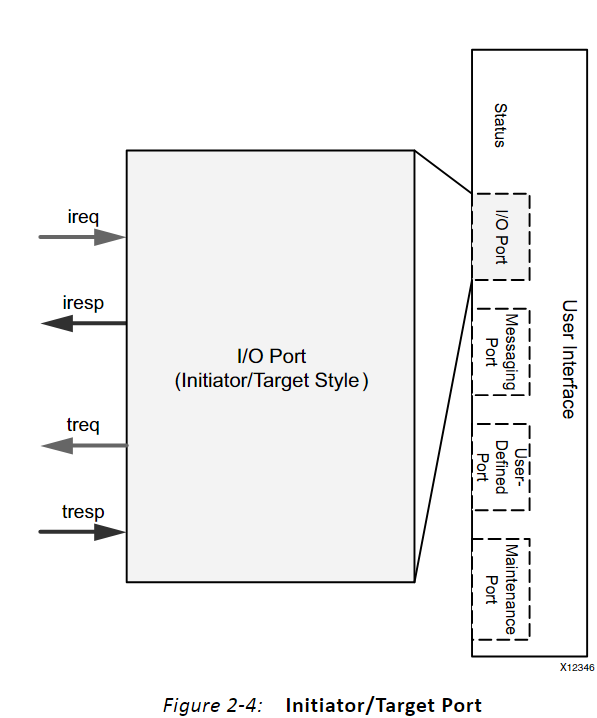

在 `Initiator/Target` 模式下，各通道的作用如下：

- 本地设备生成的请求通过 `ireq` 通道发送；
- 远程设备产生的响应通过 `iresp` 通道接收；
- 远程设备生成的请求通过 `treq` 通道接收；
- 本地设备产生的响应通过 `tresp` 通道发送。

## 2 I/O 端口数据格式

SRIO Gen2 IP 的 I/O 端口可以配置为两种数据格式：

- `HELLO` 格式；
- `SRIO Stream` 格式。

HELLO 格式包是一种精简的包格式，它将包头（Header）域标准化，简化了控制逻辑，并使数据与传输边界对齐，有助于数据管理。

在编写 Verilog 逻辑时，用户只需要按照 `HELLO` 格式的时序，将数据发送到 SRIO IP 核的 AXI4-Stream 接口。SRIO IP 核会自动将 `HELLO` 格式的数据包转换为标准 RapidIO 物理层包，并在发送过程中添加控制符号、空闲序列等必要信息。

接收过程则与发送过程相反。SRIO IP 核在接收到标准 RapidIO 物理层包后，会将其解析并转换为 `HELLO` 格式的数据包，再输出到用户侧接口，供后续逻辑处理。

这样，用户在设计事务的 Verilog 代码时，只需了解 HELLO 格式的包与时序，而不需要过多关注 RapidIO 的协议和 RapidIO 包格式。因此，一般推荐使用 HELLO 格式。

**HELLO 包头：**

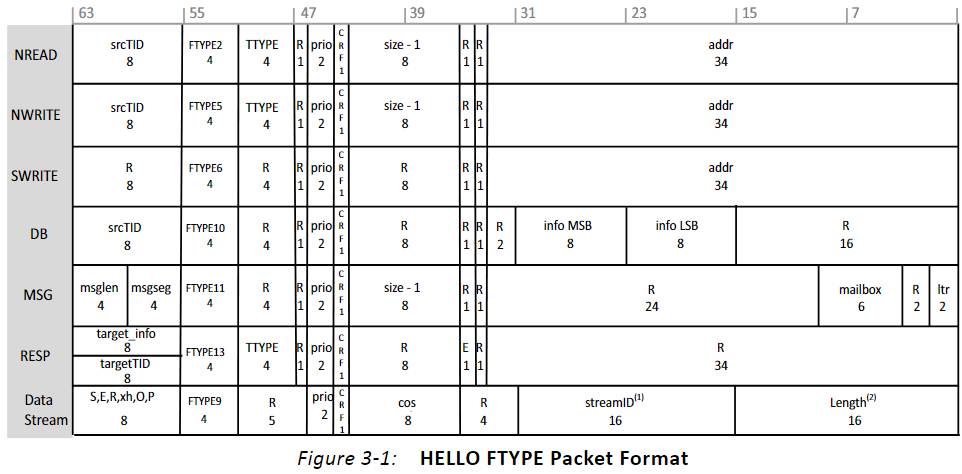

如图不同的 I/O 事务对应不同的包头。

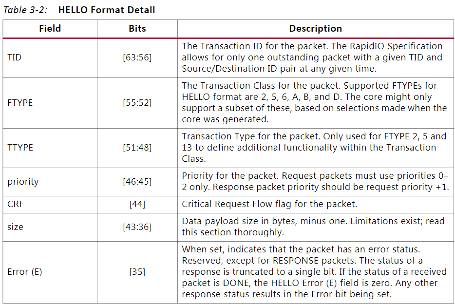
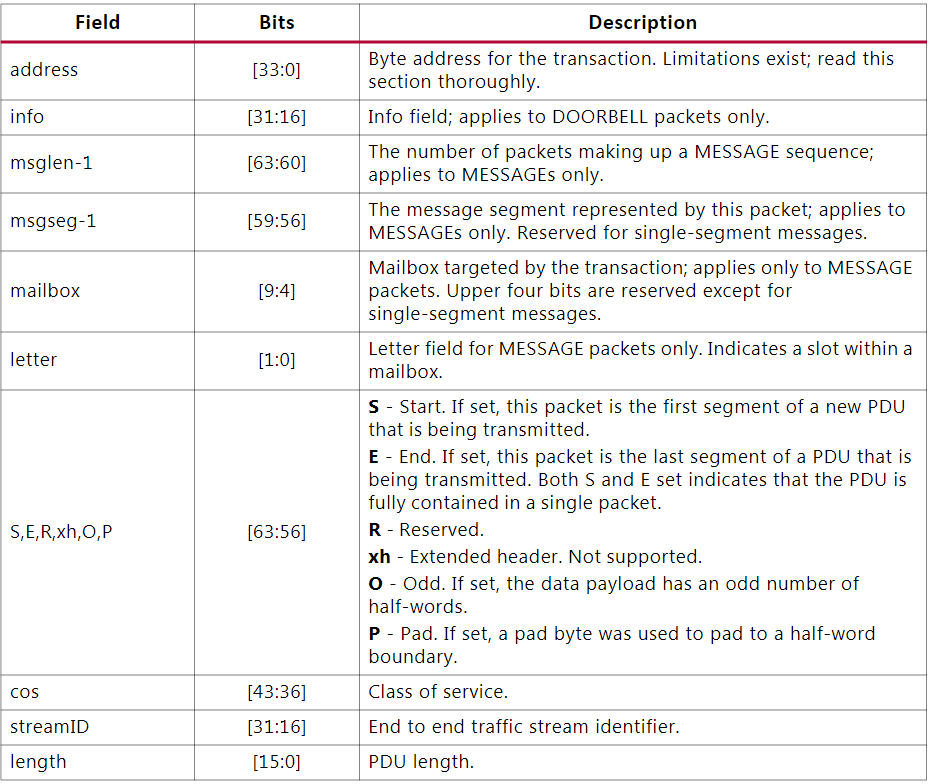

如果请求事务的数据量超过8字节，应将数据量调整为最接近的支持值。

读写事务中支持的 `HELLO` 格式数据长度包括：

- 8 Bytes；
- 16 Bytes；
- 32 Bytes；
- 64 Bytes；
- 96 Bytes，仅支持读事务；
- 128 Bytes；
- 160 Bytes，仅支持读事务；
- 192 Bytes，仅支持读事务；
- 224 Bytes，仅支持读事务；
- 256 Bytes。

HELLO 格式数据的包头在用户接口的第一个有效时钟上发送。如果事务携带数据负载，则数据负载会紧随包头连续发送。

需要注意的是，包的 `Source ID` 和 `Destination ID` 放置在 `tuser` 信号中，并且需要与包头一起在第一个有效时钟周期发送。完成第一个有效周期后，后续 `tuser` 信号中的内容将被 IP 核忽略。

下图显示了携带数据负载的 HELLO 格式包在用户接口上传输的时序图。该图展示了32字节数据负载的传输，加上包头，整个传输共花费5个时钟周期。用户只需按照类似下图的时序，将想要发送的数据送入IP核的 AXI4-Stream 接口，IP 核便会将其转换为标准的 RapidIO 串行物理层包进行发送，接收过程则是发送过程的逆过程。

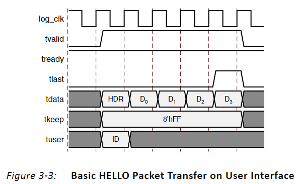

## 3 IP核配置

打开 IP 核配置界面后，主要需要关注的标签是 Basic 和 I/O 标签，其他标签的配置通常使用默认配置即可。

### 3.1 Basic 标签页

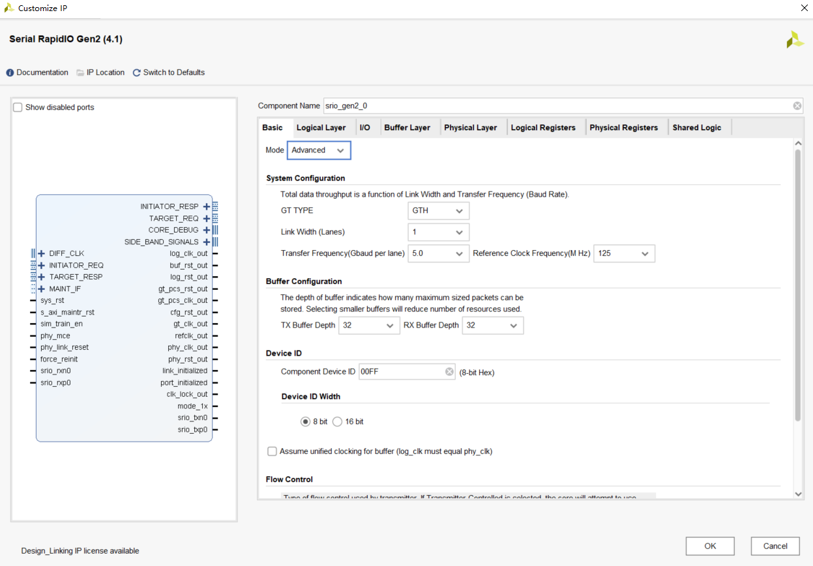

- Mode：IP 的模式，有基本（Basic）和高级（Advanced）两种。
- Link Width：链路宽度，可选值为1、2或4，链路宽度越大，数据传输的带宽越大。
- Transfer Frequency：传输频率，表示每个串行链路的传输速率，可选值为1.25、2.5、3.125、5.0 和 6.25。传输频率越大，数据传输的带宽越大。
- Reference Clock Frequency：参考时钟频率，可选值为125MHz或156.25MHz，指的是外部时钟源（如晶振或锁相环芯片）送给FPGA串行收发器专用时钟引脚的时钟频率。
- TX Buffer Depth：发送缓冲区的深度，可选值为8、16或32，表示发送缓冲区中可存储的包的最大数目。
- RX Buffer Depth：接收缓冲区的深度，可选值为8、16或 32，表示接收缓冲区中可存储的包的最大数目。
- Component Device ID：该参数是复位后Base Device ID CSR寄存器的复位值。
- Device ID Width：设备ID的宽度，收发双方的设备ID宽度应相同，否则由于包头的偏移可能导致事务被错误解释。大多数系统的 Device ID 为8位，但 RapidIO 核也提供了16位的 Device ID 供用户选择。
- Unified Clock：如果用户设计中的 log\_clk 和 phy\_clk 相同，可以选中此选项，选中后可减少延时和资源利用率。
- Transmitter Controlled：选中此选项后，RapidIO核会首先尝试使用发射端控制实现流控，但如果接收方不支持，则会自动切换为接收端控制。发射端控制流控可利用接收缓冲区的状态和水印最小化重试条件。接收端控制流控会随意发包并使用重试协议。
- Receiver Controlled：选中此选项后，RapidIO 核只能使用接收端控制实现流控，在此模式下，接收端控制流控会随意发包并使用重试协议。
- transceiver control and status ports：选中此选项可启用额外的收发器控制和状态端口。这些端口与相应设备的GTX/GTH用户指南中同名的收发器端口对应，对于调试收发链路非常有用。

### 3.2 I/O 标签页

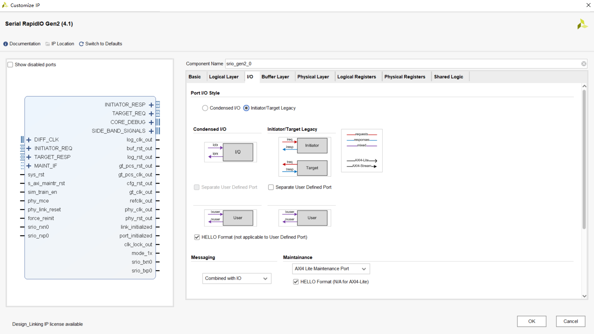

- Port I/O Style：I/O 接口可以配置为 Condensed I/O 和 Initiator/Target 两种类型。其中，Condensed I/O 模式下，接收和发送均使用一个 AXI4-Stream 通道；而在 Initiator/Target 模式下，接收和发送则采用不同的 AXI4-Stream 通道。
- I/O Format：I/O 端口可以配置为使用 HELLO 格式包或 SRIO Stream 格式包。通常，强烈推荐使用 HELLO 格式。
- Messaging：用于选择消息事务的端口类型，参数可选为 Combined with IO 或 Separate Messaging Port。Combined with IO 选项表示消息事务与 I/O 写事务使用相同的 I/O 端口；选择 Separate Messaging Port 选项则表示消息事务使用独立的端口进行传输，选择此项后，IP 核将出现专用于消息事务的 AXI4-Stream 通道。
- Maintenance：用于选择维护端口类型，维护端口类型仅限于 AXI4-Lite。

## 4 PMA环回实例

### 4.1 配置IP

将链路宽度设置为2，启用额外的收发器控制和状态端口，其余配置保持默认。

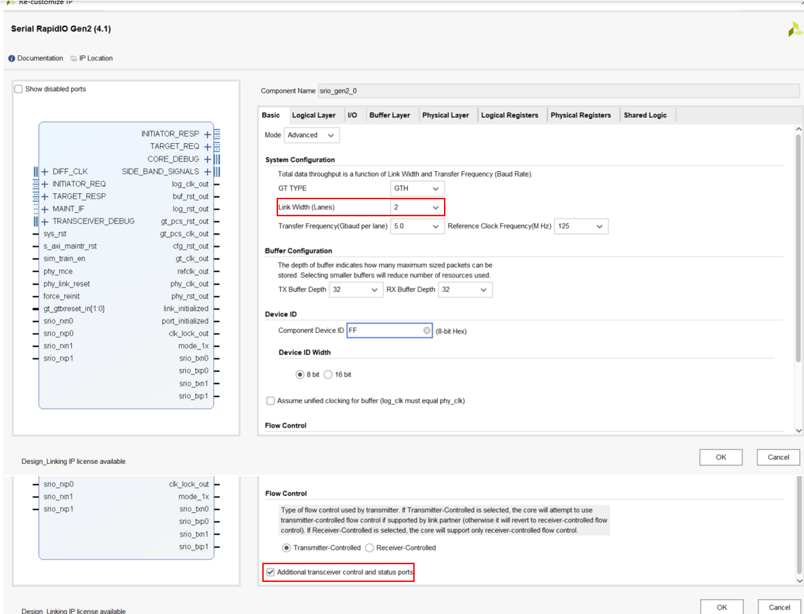

### 4.2 IP 连线

根据 GTH 用户指南，GTH 收发器支持以下几种工作模式：

- 正常工作模式；
- 近端 PCS 子层环回；
- 远端 PCS 子层环回；
- 近端 PMA 子层环回；
- 远端 PMA 子层环回。

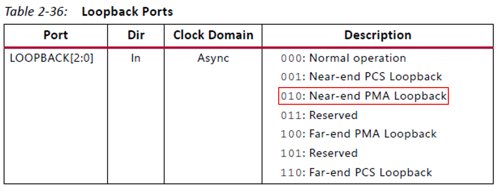

`sim_train_en` 信号用于控制仿真训练过程：

- 仿真时，`sim_train_en` 应置为 1；
- 实际硬件运行时，`sim_train_en` 应置为 0。

在本例中，将 `gt_loopback_in[5:0]` 配置为 `6'b010010`，使 GTH 工作在近端 PMA 环回模式。

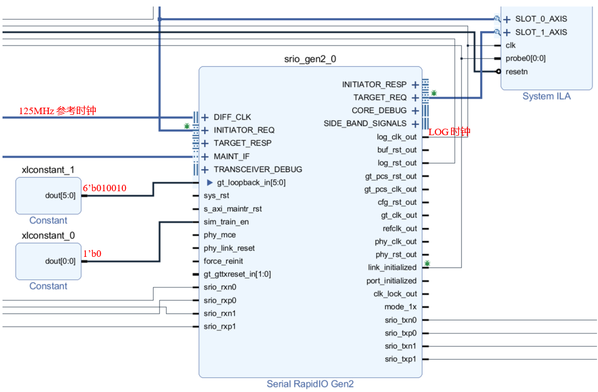

### 4.3 环回测试

如图所示，ireq 通道发送了一个256 bytes 负载的 SWRITE 事务和一个 DOORBELL 事务，经过大约1us的时间环回到 treq 通道。

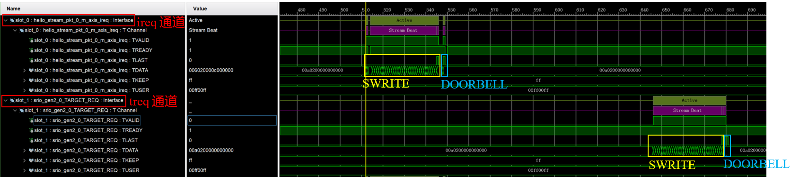

#### 4.3.1 SWRITE 事务

SWRITE 事务的包头为: 64’h006020000c000000。

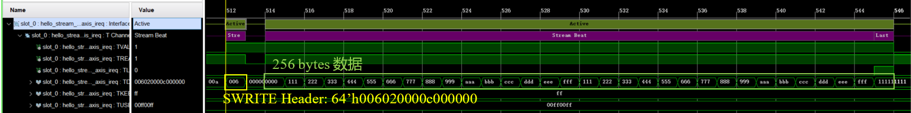

将该包头转换为二进制后，可以与 `HELLO` 格式中的各个字段进行对应解析，如下图所示。

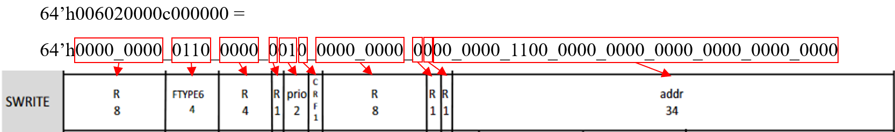

#### 4.3.2 DOORBELL 事务

DOORBELL事务为: 64’h00a0200000000000。

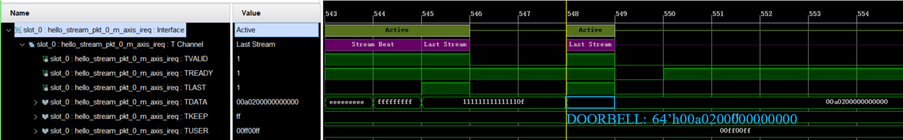

将该包头转换为二进制后，可以与 `HELLO` 格式中的各个字段进行对应解析，如下图所示。

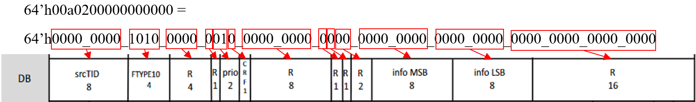

## 5 REFERENCE

1. [SRIO 学习笔记](https://www.cnblogs.com/liujinggang/p/10072115.html)
2. `UG576 UltraScale Architecture GTH Transceivers User Guide`
3. `PG007 SRIO Gen2 Product Guide`