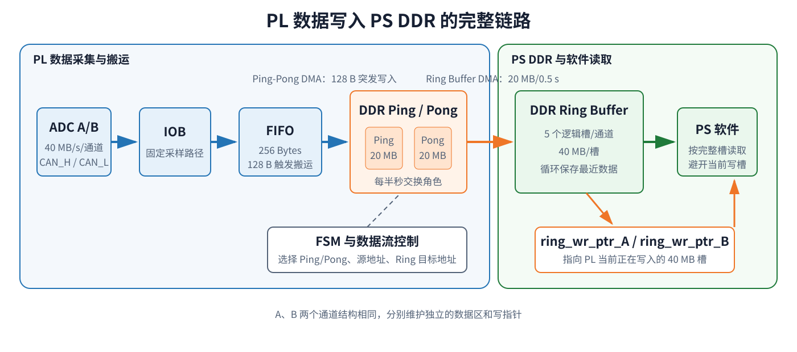
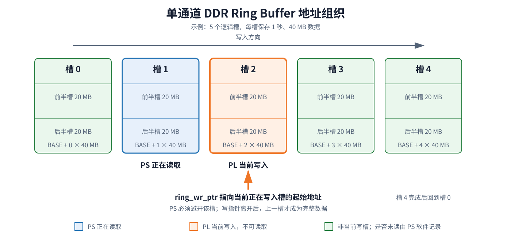
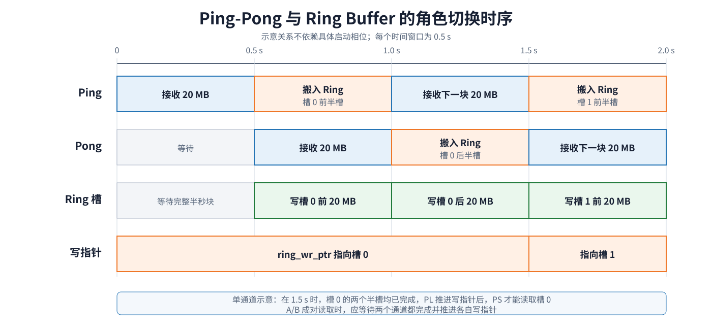

# Zynq PL 数据写入 PS DDR 的环形缓存机制

在 Zynq 数据采集系统中，真正需要解决的问题并不只是“把 PL 数据写进 DDR”，而是如何在数据连续产生、AXI 访问延迟存在波动、PS 读取时间不固定的情况下，仍然保证采集链路持续运行。

本文以双通道 ADC 数据链路为例，说明 PL 数据经由 FIFO、DDR Ping-Pong Buffer 和 DDR Ring Buffer 进入 PS DDR 的完整过程。文章不展开 RTL、DMA 驱动或 Vivado 工程搭建，重点解释各级缓存的作用、环形缓存的地址组织、读写指针语义以及 PL 与 PS 之间的数据交接机制。

## 1 设计目标

系统包含 A、B 两个 ADC 通道：

- A 通道采集 `CAN_H`，数据率为 40 MB/s；
- B 通道采集 `CAN_L`，数据率为 40 MB/s；
- 两个通道合计持续产生 80 MB/s 数据。

PL 需要把两路数据连续写入 PS DDR，PS 再从 DDR 中读取并处理。由于 PL 是持续工作的生产者，而 PS 软件会受到任务调度、缓存和处理耗时的影响，二者不能依赖严格同步。

如果 PL 始终向一块固定 DDR 区域写入，PS 可能在数据尚未写完时开始读取，也可能在读取过程中遇到 PL 覆盖同一地址。因此，数据链路采用三级缓存：

1. FIFO 吸收 AXI 总线的短时延迟波动；
2. Ping-Pong Buffer 隔离“正在接收”和“正在搬运”的数据块；
3. Ring Buffer 保存连续时间数据，并通过写指针告诉 PS 当前不可读取的区域。

## 2 整体数据链路

  

需要注意的是，PL 和 PS 访问的是同一片物理 DDR。PL 通过 AXI 主设备接口把数据写入 DDR，PS 并不需要再从 PL 接口逐字节接收数据，而是直接读取已经写好的 DDR 地址。

| 模块 | 数据粒度 | 主要作用 |
| --- | --- | --- |
| IOB 采样 | ADC 采样点 | 固定输入采样路径，获得稳定的 ADC 数字信号 |
| FIFO | 256 Bytes | 吸收 AXI 突发传输延迟，避免连续采样数据丢失 |
| Ping-Pong DMA | 128 Bytes/次 | 将 FIFO 数据以突发方式写入当前活动缓冲区 |
| DDR Ping/Pong | 20 MB/块/通道 | 保存半秒数据，使一块接收时另一块可以搬运 |
| Ring Buffer DMA | 20 MB/次/通道 | 将已完成的 Ping 或 Pong 数据搬入环形缓存 |
| DDR Ring Buffer | 40 MB/槽/通道 | 保存一秒数据，并按逻辑槽循环使用 |
| `ring_wr_ptr_A/B` | 一个槽地址 | 指示 PL 当前正在写入的 40 MB 区域 |
| PS 软件 | 按槽读取 | 避开当前写入槽，读取已经完成的数据 |

## 3 三级缓存为什么缺一不可

### 3.1 FIFO：吸收短时间的总线抖动

ADC 数据持续进入 PL，但 AXI 总线并不能保证每次请求都立即得到响应。当总线繁忙时，一次突发搬运可能比正常情况耗时更长，FIFO 用于暂存这段时间继续到来的采样数据。

本设计每次从 FIFO 搬运 128 Bytes。实测最慢一次突发搬运需要 234 个 200 MHz 时钟周期，即约 1.17 μs。单通道在这段时间内还会产生约 47 Bytes 数据，因此 FIFO 至少需要容纳 128 + 47 = 175 Bytes。

最终采用 256 Bytes FIFO，相当于预留两组 128 Bytes 空间：一组数据正在搬运时，后一组数据仍可继续写入。FIFO 中的数据达到 128 Bytes 后，`Pro_Full` 置高，数据流控制模块便可以启动一次 AXI 突发搬运。

FIFO 解决的是微秒级抖动问题，它不能替代后面的 Ping-Pong Buffer 和 Ring Buffer。

### 3.2 Ping-Pong Buffer：让接收与搬运同时进行

单通道数据率为 40 MB/s，因此半秒数据量为 20 MB。DDR Ping 和 DDR Pong 分别承担一个半秒数据块：

- Ping 处于接收状态时，Pong 中上一块完整数据可以搬入 Ring Buffer；
- Pong 处于接收状态时，Ping 中上一块完整数据可以搬入 Ring Buffer；
- 每经过半秒，两块缓冲区交换角色。

Ping-Pong Buffer 的核心不是增加历史缓存深度，而是保证“写入新数据”和“搬运已完成数据”互不占用同一块缓冲区。只要 Ring Buffer DMA 能在另一块缓冲区写满前完成搬运，ADC 采集就可以连续运行。

### 3.3 Ring Buffer：隔离持续写入与软件读取

Ping-Pong Buffer 只能解决两块数据之间的交替问题，无法吸收 PS 侧秒级的调度和处理延迟。Ring Buffer 将 DDR 划分为多个固定大小的逻辑槽，PL 按顺序写入这些槽，到达末尾后再回到第一个槽。

原设计以一秒数据作为一个逻辑槽：

- 单通道一个槽为 40 MB；
- 一个槽由两个 20 MB 半槽组成；
- 前半槽和后半槽分别接收一次 Ping/Pong 搬运；
- 两个半槽都写完后，该一秒数据才算完整。

文档中的时间计数器按 0～4 循环，因此本文按 5 个逻辑槽说明。单通道 Ring Buffer 总容量为 5 × 40 MB = 200 MB，两个通道分别维护独立的 Ring Buffer。

## 4 DDR Ring Buffer 的地址组织

  

假设单通道 Ring Buffer 基地址为 `BASE`，一个槽大小为 40 MB，则第 n 个槽的起始地址为：

`BASE + n × 40 MB`

每个槽内部又分为两个半槽：

- 前半槽偏移为 0，保存第一个 0.5 s 数据；
- 后半槽偏移为 20 MB，保存第二个 0.5 s 数据。

当槽 4 写完后，下一个目标槽重新回到槽 0，这就是地址回卷。地址本身会重复使用，因此环形缓存保存的是“最近一段时间的数据”，而不是无限增长的数据文件。

### 4.1 写指针的准确含义

`ring_wr_ptr_A` 和 `ring_wr_ptr_B` 指向的不是“最后一块已经完成的数据”，而是 PL 当前正在写入的 40 MB 槽起始地址。

这一定义非常重要：

- 写指针指向的槽可能只写完前 20 MB，也可能仍在写后 20 MB；
- PS 不能读取写指针当前指向的槽；
- 只有写指针离开一个槽后，才能确认该槽的一秒数据已经完整。

为了维持“写指针始终指向当前写槽”的语义，实现上应保证：

1. 两个 20 MB 半槽全部写入 DDR；
2. Ring Buffer DMA 根据工程中的 DMA 或 AXI 写完成条件确认搬运结束；
3. PL 再把 `ring_wr_ptr` 更新到下一个槽。

如果先更新指针、后完成 DDR 写入，PS 就可能把尚未写完的数据误认为完整数据。

### 4.2 PS 侧需要维护自己的读取位置

PL 只负责持续推进写指针，PS 需要在软件中维护自己的读取位置。一次典型读取过程如下：

1. 连续读取 `ring_wr_ptr_A` 和 `ring_wr_ptr_B`，并通过重复读取或硬件快照确认指针处于稳定状态；
2. 将两个写指针当前指向的槽都标记为不可读；
3. 按时间顺序选择已经完成、尚未处理的逻辑槽；
4. 如果 A、B 数据需要成对处理，应确认两个写指针都已离开目标槽；
5. 读取对应的 A、B 通道数据；
6. 数据处理完成后，推进 PS 自己维护的读取位置；
7. 读取结束后再次检查写指针，以发现一般的槽位推进。

需要注意的是，仅凭循环地址无法排除写指针已经完整回卷一圈后又回到同一地址。若系统必须可靠检测覆盖，需要额外的写入轮次或单调递增序号；该序号属于工程化扩展，并非原文中已有的寄存器。

通常可以优先读取写指针前一个槽，因为它是最近完成的一秒数据。如果软件需要连续处理所有数据，则应维护独立的软件读指针，而不是每次只读取最新槽。

## 5 一次完整的数据传输过程

  

一次完整传输可以分为以下几个阶段。

### 5.1 ADC 数据进入 FIFO

IOB 寄存器对 ADC 数字信号进行采样，A、B 两个通道的数据分别进入各自 FIFO。FIFO 持续写入，不等待 PS 软件参与。

### 5.2 FIFO 数据写入活动缓冲区

当 FIFO 中累计到 128 Bytes 数据后，数据流控制模块启动 Ping-Pong DMA。DMA 通过 AXI 总线把数据写入当前活动的 DDR Ping 或 DDR Pong 缓冲区，并不断累加目标地址。

### 5.3 半秒边界交换 Ping/Pong 角色

当前活动缓冲区累计 20 MB 后，说明已经保存了半秒数据。FSM 将其标记为完整，并切换到另一块缓冲区继续接收新数据。

与此同时，Ring Buffer DMA 从刚刚完成的缓冲区读取 20 MB 数据，写入当前 Ring Buffer 槽的前半槽或后半槽。接收和搬运使用不同的 Ping/Pong 区域，因此可以并行进行。

### 5.4 一秒数据完成并推进写指针

连续两次 20 MB 搬运组成一个完整的 40 MB 逻辑槽。对于每个通道，后 20 MB 搬运完成后：

1. 该通道当前一秒数据变为完整数据；
2. 该通道的时间槽编号加 1；
3. 相应的 `ring_wr_ptr` 指向下一个 40 MB 槽；
4. 槽 4 的后半槽搬运完成后，下一槽编号回到 0。

从这个时刻开始，PS 才可以安全读取该通道刚刚完成的槽。若 A、B 数据需要成对读取，应等待两个通道的写指针都离开上一槽。

## 6 环形缓存的覆盖机制

### 6.1 原设计行为

当前设计只把 PL 写指针提供给 PS，没有把 PS 读指针反馈给 PL。这意味着 PL 不会因为 PS 读取过慢而停止采集，而是始终按照固定速率循环写入。

这种机制本质上采用“覆盖最旧数据”的策略：

- 优点是采集链路不会被 PS 阻塞；
- 代价是 PS 如果长期跟不上，尚未处理的数据会被下一圈写入覆盖。

5 个一秒槽可以保存约 5 秒地址空间。稳定运行后，其中当前正在写入的 1 个槽不能读取，因此最多保留约 4 个已完成槽；系统刚启动时，有效槽数量需要随实际完成情况逐步增加。PS 的长期平均处理速度必须不低于数据产生速度，即单通道 40 MB/s、双通道合计 80 MB/s。

### 6.2 工程化扩展建议

如果系统必须保证任何数据都不能被覆盖，则还需要增加 PS 读指针或“数据已消费”确认信号。PL 在写指针即将追上读指针时，可以选择暂停、丢弃新数据或上报告警。原设计没有这一反馈路径，因此软件侧必须自行保证处理实时性。

仅使用循环地址还存在一个问题：PS 无法判断写指针是否已经完整绕行一圈。为了检测数据覆盖，工程中可以额外提供一个单调递增的写入序号。地址负责定位 DDR 槽，序号负责判断数据属于第几轮，两者结合后更容易发现丢帧或覆盖。

## 7 双通道数据如何保持对应

A、B 两个通道分别使用 `ring_wr_ptr_A` 和 `ring_wr_ptr_B`，两路数据描述的是同一时间段的 `CAN_H` 和 `CAN_L`。原文只明确了两个通道分别提供写指针，没有说明寄存器原子快照、时间戳或序号机制。若 PS 需要把两路数据成对处理，可采用以下工程化约束：

建议遵循以下原则：

- A、B 两个通道使用相同的半秒切换时刻；
- 两路 Ring Buffer 使用相同的槽编号和回卷规则；
- PS 在同一轮中连续读取两个写指针，并重复读取以确认它们处于稳定状态；
- 只有两个写指针都离开目标槽，才能确认该槽中的两路数据均已完整；
- 如果两个指针不在同一逻辑槽，PS 应等待或重新读取，而不是拼接不同时间段的数据；
- 如需增强可追溯性，可为每个槽增加相同的时间戳或序号，便于软件确认两路数据属于同一采集窗口。

## 8 工程化扩展建议与边界条件

下表前几项直接关系到原设计的数据完整性，Cache、内存保留、复位恢复和时间戳等内容属于系统集成时需要补充确认的工程化措施。

| 场景 | 可能问题 | 处理原则 |
| --- | --- | --- |
| AXI 总线短时繁忙 | FIFO 溢出，采样数据丢失 | FIFO 深度应覆盖最坏突发延迟，并监测溢出状态 |
| Ring DMA 速度不足 | Ping/Pong 角色切换时上一块仍未搬完 | 20 MB 搬运必须在下一个半秒窗口内完成 |
| PS 读取当前写入槽 | 读到前后不一致或不完整数据 | 始终排除 `ring_wr_ptr` 当前指向的槽 |
| PS 处理速度过慢 | PL 回卷并覆盖未读数据 | 提高处理吞吐率，或增加读指针/序号检测机制 |
| PS CPU Cache 未同步 | PS 读到旧缓存内容 | 使用不可缓存映射，或在读取前执行正确的缓存失效操作 |
| DDR 地址被系统占用 | PL 写入破坏其他内存 | Ring Buffer 和 Ping/Pong 地址必须在系统内存规划中保留 |
| PL 或 PS 单侧复位 | 指针与有效数据状态不一致 | 复位后重新初始化槽状态，并等待新的完整槽产生 |
| A/B 指针不同步 | `CAN_H` 与 `CAN_L` 时间错位 | 同步快照两个指针，并用时间戳或序号校验 |

## 9 总结

PL 数据进入 PS DDR 的关键，不是某一次 AXI 写事务，而是多级缓存之间的职责划分：

- FIFO 处理微秒级总线抖动；
- Ping-Pong Buffer 让数据接收与大块搬运并行；
- Ring Buffer 吸收 PS 的调度和处理延迟；
- `ring_wr_ptr_A/B` 明确当前不可读取的 DDR 区域；
- PS 通过自己的读取位置，在 PL 持续写入的同时消费已经完成的数据。

整套机制的核心规则可以概括为：PL 先完成 DDR 数据写入，再推进写指针；PS 始终避开写指针当前槽，并在数据被下一圈覆盖前完成读取。

